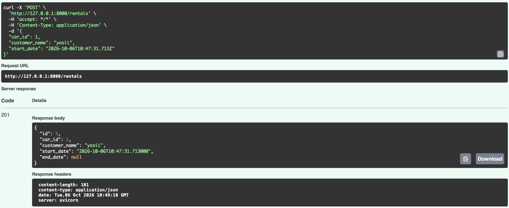
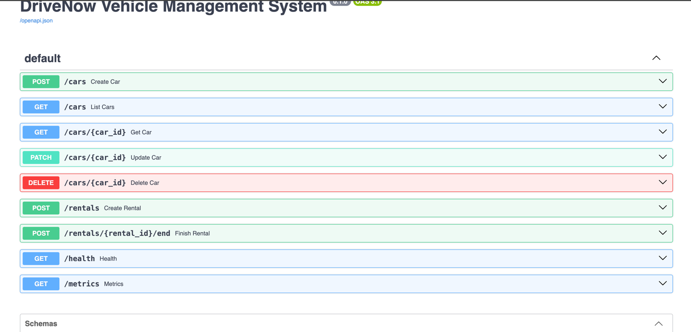
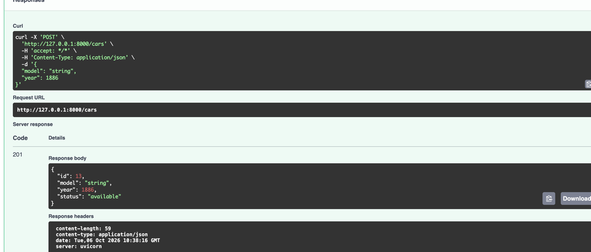
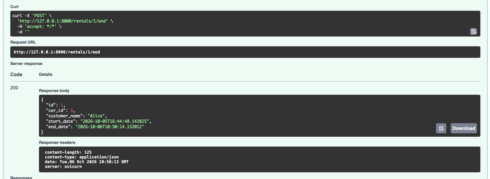

# DriveNow Vehicle Management System

A simple Python REST API for managing vehicles and car rentals.

## Architecture

The application is divided into separate layers:

```text
Client
   |
   v
FastAPI API
   |
   v
Business Logic / Services
   |
   v
Data Access / Repositories
   |
   v
SQLite Database
```

### Layers

* **API** - Handles HTTP requests and responses.
* **Services** - Contains the business logic.
* **Repositories** - Handles database access.
* **Models** - Defines the database tables.
* **Schemas** - Defines request and response data.
* **Metrics** - Collects application metrics.
* **Logging** - Records important application events.

This separation keeps the application simple and makes it easier to maintain and extend.

## Technologies

* Python 3.12
* FastAPI
* SQLAlchemy
* SQLite
* Prometheus Client
* Pytest
* Docker
* Docker Compose

## Project Structure

```text
car-rental-system/
|
├── app/
│   ├── __init__.py
│   ├── main.py
│   ├── api.py
│   ├── db.py
│   ├── models.py
│   ├── schemas.py
│   ├── repositories.py
│   ├── services.py
│   ├── logging_config.py
│   └── metrics.py
|
├── tests/
│   ├── __init__.py
│   ├── test_cars.py
│   └── test_rentals.py
|
├── data/
|
├── Dockerfile
├── docker-compose.yml
├── requirements.txt
├── .gitignore
└── README.md
```

## Running Locally

### 1. Create a virtual environment

```bash
python -m venv .venv
```

### 2. Activate the virtual environment

Windows PowerShell:

```powershell
.\.venv\Scripts\Activate.ps1
```

### 3. Install dependencies

```bash
pip install -r requirements.txt
```

### 4. Run the application

```bash
uvicorn app.main:app --reload
```

The application will be available at:

```text
http://127.0.0.1:8000
```

## API Documentation

FastAPI provides interactive API documentation at:

```text
http://127.0.0.1:8000/docs
```

## Health Check

To check that the application is running:

```http
GET /health
```

Example response:

```json
{
  "status": "ok"
}
```

## API Usage

### Create a Car

```http
POST /cars
```

Request:

```json
{
  "model": "Toyota Corolla",
  "year": 2024
}
```

Example response:

```json
{
  "id": 1,
  "model": "Toyota Corolla",
  "year": 2024,
  "status": "available"
}
```

### List All Cars

```http
GET /cars
```

### Filter Cars by Status

```http
GET /cars?status=available
```

Supported statuses:

```text
available
in_use
maintenance
```

### Get a Car

```http
GET /cars/{car_id}
```

Example:

```text
GET /cars/1
```

### Update a Car

```http
PATCH /cars/{car_id}
```

Example request:

```json
{
  "status": "maintenance"
}
```

### Delete a Car

```http
DELETE /cars/{car_id}
```

Example:

```text
DELETE /cars/1
```

### Create a Rental

```http
POST /rentals
```

Request:

```json
{
  "car_id": 1,
  "customer_name": "John Doe",
  "start_date": "2026-10-05T16:00:00"
}
```

When a rental is created, the car status changes to:

```text
in_use
```

### End a Rental

```http
POST /rentals/{rental_id}/end
```

Example:

```text
POST /rentals/1/end
```

When a rental ends, the car status changes back to:

```text
available
```

## Logging

The application uses Python's built-in logging module.

Logs are written to:

```text
app.log
```

Logs are also displayed in the console.

Important operations such as health checks and rental operations are logged.

## Metrics

Application metrics are available at:

```text
http://127.0.0.1:8000/metrics
```

The application collects metrics for:

* Total HTTP requests
* HTTP request duration
* Number of active cars
* Number of ongoing rentals

## Running Tests

Run all tests with:

```bash
pytest
```

The project includes tests for:

* Creating cars
* Listing cars
* Updating cars
* Creating rentals
* Ending rentals
* Updating car status after a rental

## Running with Docker

Build and start the application:

```bash
docker compose up --build
```

The API will be available at:

```text
http://localhost:8000
```

Swagger documentation:

```text
http://localhost:8000/docs
```

Health check:

```text
http://localhost:8000/health
```

Metrics:

```text
http://localhost:8000/metrics
```

To stop the application:

```bash
docker compose down
```

## Database

The application uses SQLite with SQLAlchemy as the ORM.

The database contains two main tables:

### Cars

Stores:

* Car ID
* Model
* Year
* Status

### Rentals

Stores:

* Rental ID
* Car ID
* Customer name
* Start date
* End date

SQLite was selected because it is simple to run, requires no separate database server, and is sufficient for this small standalone application.

## Git Workflow

The project was developed using feature branches.

Examples:

```text
feature/project-setup
feature/database
feature/api-foundation
feature/logging
feature/tests
feature/docker
feature/documentation
```

Changes were merged into the `main` branch using clear commit messages.

## Example Flow

A typical rental flow is:

```text
1. Create a car
       |
       v
2. Car status = available
       |
       v
3. Create a rental
       |
       v
4. Car status = in_use
       |
       v
5. End the rental
       |
       v
6. Car status = available
```

## Future Improvements

Possible future improvements include:

* PostgreSQL for production use
* Database migrations
* Authentication and authorization
* Message queue integration
* More detailed monitoring
* Additional API endpoints


## Screenshots








